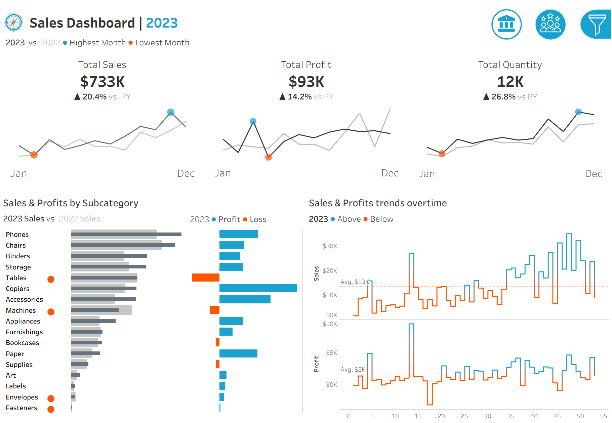

# 📊 Sales & Profitability Analysis | Tableau Deep Dive

## Executive Summary
This project focuses on identifying regional margin compression using advanced Tableau visualization techniques. My goal was to move beyond static reporting and create an interactive tool for stakeholders to isolate "loss-leader" products in real-time.

## The Insights
* **Regional Disparity:** While Sales are up 20.4% YoY, Profit only grew by 14.2%. 
* **The Culprit:** The **South Region** operates at a 2% margin (vs. 12% average). 
* **Specific Impact:** High-volume sales in **Tables** and **Machines** are actually eroding total profit in that region.

## Dashboard Preview

## Technical Tableau Highlights
Since this project was built directly within Tableau, I utilized the following native features to transform the raw data:

1. **LOD (Level of Detail) Expressions:** Created Fixed LODs to compare regional margins against the global average regardless of the filters applied.
2. **Year-over-Year (YoY) Calculations:** Built custom calculated fields to track growth vs. Prior Year (PY) for Sales, Profit, and Quantity.
3. **Dynamic Visual Encoding:** Implemented conditional color formatting (Orange/Blue) to immediately alert users to subcategories generating a net loss.
4. **Interactivity:** Designed the dashboard with global filters and dashboard actions, allowing users to "drill down" from high-level KPIs to specific subcategory trends.

## 🔗 Interactive Version
To explore the interactive filters and drill-down features of this dashboard, visit the live version on Tableau Public:
[**👉 View Live Dashboard on Tableau Public**]([PASTE_YOUR_LINK_HERE](https://public.tableau.com/app/profile/nataliia.bilousova/viz/SalesDashboardCaseStudy_17754461712580/SalesDashboard))
